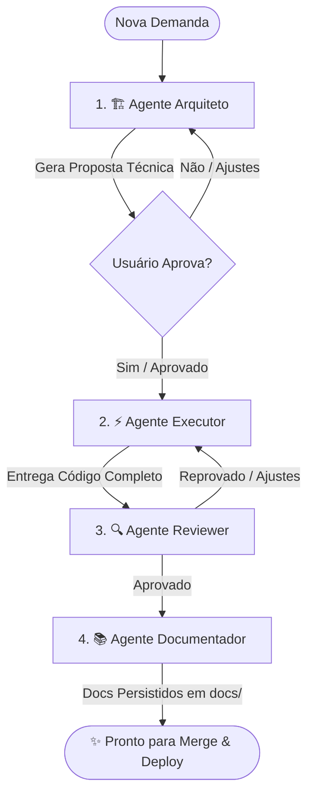

# 🤖 Agentes Especialistas & Skills - Sistema de Agendamento (Go + Vue 3)

Este diretório contém a suíte de agentes especialistas e skills de engenharia de software configurados especificamente para a stack do projeto **`sistema-agendamento`**.

---

## 👥 Agentes Disponíveis

| Agente | Arquivo | Função Principal |
| :--- | :--- | :--- |
| **🏗️ Agente Arquiteto** | [`AGENTE_ARQUITETO.md`](./AGENTE_ARQUITETO.md) | Analisa demandas, planeja o modelo de dados (GORM), rotas REST (Gin), jobs assíncronos (Asynq) e interfaces Vue 3. **Bloqueia execução até aprovação.** |
| **⚡ Agente Executor** | [`AGENTE_EXECUTOR.md`](./AGENTE_EXECUTOR.md) | Escreve código de produção 100% completo, tipado, modular e funcional em Go 1.24+ e Vue 3, sem omissões. |
| **🔍 Agente Reviewer** | [`AGENTE_REVIEWER.md`](./AGENTE_REVIEWER.md) | Audita segurança (OWASP), concorrência/goroutines, N+1 no GORM, tratamento de erros e boas práticas antes do merge. |
| **📚 Agente Documentador** | [`AGENTE_DOCUMENTADOR.md`](./AGENTE_DOCUMENTADOR.md) | Gera e mantém a documentação técnica, GoDoc, catálogo de endpoints REST e documentações no diretório `docs/`. |

---

## 📐 Skills Disponíveis

- **`golang-architecture`** ([`skills/golang-architecture/SKILL.md`](./skills/golang-architecture/SKILL.md)): Padrões arquiteturais para Clean Architecture em Go 1.24+, Gin Gonic, GORM, Asynq (Redis), AES-256-GCM, Vue 3 e regras de isolamento de banco em testes.

---

## 🔄 Ciclo de Desenvolvimento Recomendado

