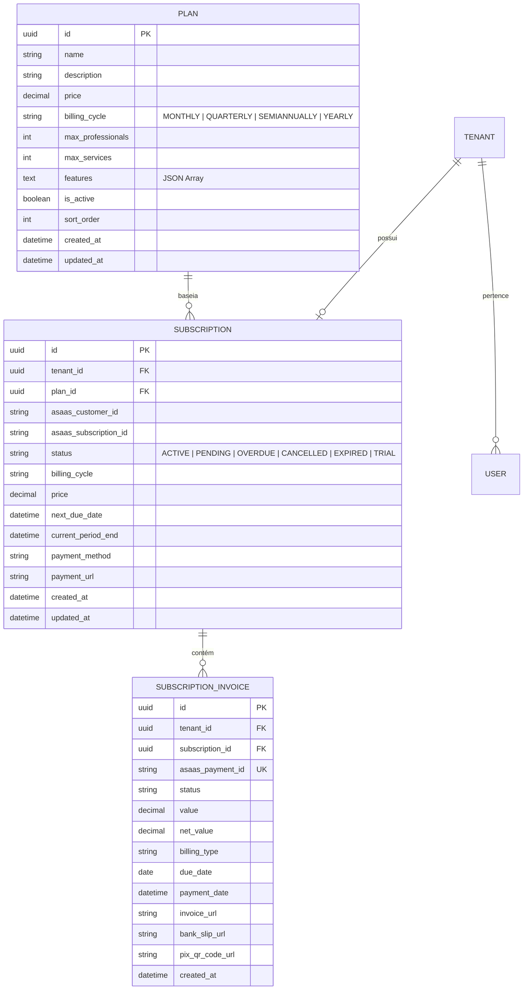

# 💳 Módulo de Planos de Assinatura, Integração Asaas & Gestão de Estabelecimentos

Este documento descreve a arquitetura, modelos de dados, fluxo de integração com o gateway **Asaas (v3)**, políticas de controle de acesso (Gatekeeper) e as interfaces de visualização e gestão para o **Administrador Geral** e **Estabelecimentos**.

---

## 1. 📌 Visão Geral do Módulo

O módulo gerencia a monetização e o ciclo de vida dos estabelecimentos na plataforma, separando rigorosamente:
1. **Planos de Assinatura (`Plan`):** Grade de ofertas comerciais gerenciada exclusivamente pelo Administrador Geral (`ADMIN_GLOBAL`). Define preços, periodicidades de cobrança (`MONTHLY`, `QUARTERLY`, `SEMIANNUALLY`, `YEARLY`), limites de profissionais/serviços e recursos/benefícios.
2. **Assinaturas dos Estabelecimentos (`Subscription`):** Contratação efetiva de um plano por um estabelecimento (`Tenant`), vinculada ao cliente e à assinatura recorrente no Asaas. Congela o valor e a periodicidade no momento da contratação.
3. **Histórico de Faturas (`SubscriptionInvoice`):** Registro sincronizado via Webhook de todas as faturas geradas, pagas ou vencidas no Asaas.
4. **Gatekeeper de Acesso (`RequireActiveSubscription`):** Middleware que intercepta as rotas operacionais do tenant (`/appointments`, `/services`, `/professionals`, `/customers`) e bloqueia o acesso caso a assinatura esteja `PENDING`, `OVERDUE` ou `CANCELLED`.
5. **Painel de Situação da Assinatura (`TenantsManagementView`):** Visão centralizada onde o Admin Geral visualiza o status financeiro de cada estabelecimento, filtra por situação e gerencia manualmente as assinaturas.

---

## 2. 🗄️ Modelo de Dados (GORM / PostgreSQL)



---

## 3. 🔌 Integração Asaas API v3 & Webhooks

### 3.1 Cliente Asaas ([client.go](file:///home/charles/projetos/sistema-agendamento/backend/internal/integrations/asaas/client.go))
O cliente HTTP implementa a porta `domain.AsaasProvider`:
- `CreateCustomer(ctx, req)`: Cria ou recupera o cliente no Asaas (`POST /v3/customers`).
- `CreateSubscription(ctx, req)`: Cria a assinatura recorrente vinculada (`POST /v3/subscriptions`).
- `GetSubscription(ctx, id)`: Consulta detalhes da assinatura.
- `CancelSubscription(ctx, id)`: Cancela a cobrança recorrente no Asaas (`DELETE /v3/subscriptions/:id`).

### 3.2 Processamento de Webhooks ([webhook_handler.go](file:///home/charles/projetos/sistema-agendamento/backend/internal/handler/webhook_handler.go))
Endpoint público protegido por token secreto:
- **URI:** `POST /api/v1/webhooks/asaas`
- **Cabeçalho de Validação:** `asaas-access-token: <ASAAS_WEBHOOK_SECRET>`

#### Eventos Processados:
| Evento Asaas | Ação no Sistema | Novo Status da Assinatura |
|---|---|---|
| `PAYMENT_RECEIVED` / `PAYMENT_CONFIRMED` | Registra/atualiza fatura e renova data de vencimento | `ACTIVE` 🟢 |
| `PAYMENT_OVERDUE` | Notifica inadimplência e bloqueia recursos operacionais | `OVERDUE` 🔴 |
| `SUBSCRIPTION_DELETED` | Cancela o vínculo contratual | `CANCELLED` ⚫ |

---

## 4. 🛡️ Middleware Gatekeeper (`RequireActiveSubscription`)

Localizado em [subscription.go](file:///home/charles/projetos/sistema-agendamento/backend/internal/middleware/subscription.go):
- Intercepta requisições de operadores e administradores de estabelecimentos.
- Caso o usuário seja `ADMIN_GLOBAL`, o acesso é irrestrito.
- Para usuários do Tenant (`ADMIN_TENANT`, `OPERATOR`), verifica se a assinatura está `ACTIVE` ou `TRIAL`.
- Caso contrário, interrompe a requisição retornando **HTTP 403 Forbidden**:

```json
{
  "success": false,
  "error": "Acesso bloqueado: o estabelecimento requer uma assinatura ativa.",
  "code": "SUBSCRIPTION_REQUIRED",
  "data": {
    "subscription_status": "PENDING",
    "plan_name": "Plano Profissional",
    "payment_url": "https://sandbox.asaas.com/i/mock123"
  }
}
```

---

## 5. 📖 Catálogo de Endpoints REST (Gin)

### 5.1 Rotas Públicas
| Método | Endpoint | Descrição |
|---|---|---|
| `GET` | `/api/v1/public/plans` | Lista os planos comerciais ativos para o onboarding |
| `POST` | `/api/v1/webhooks/asaas` | Recebe notificações de pagamento do Asaas |

### 5.2 Rotas do Administrador Geral (`ADMIN_GLOBAL`)
| Método | Endpoint | Descrição |
|---|---|---|
| `GET` | `/api/v1/admin/plans` | Lista todos os planos (ativos e inativos) |
| `POST` | `/api/v1/admin/plans` | Cadastra novo plano comercial |
| `GET` | `/api/v1/admin/plans/:id` | Visualiza detalhes de um plano |
| `PUT` | `/api/v1/admin/plans/:id` | Atualiza parâmetros de um plano |
| `PATCH` | `/api/v1/admin/plans/:id/status` | Ativa ou desativa contratação do plano |
| `DELETE` | `/api/v1/admin/plans/:id` | Exclui plano (protegido contra exclusão com assinantes) |
| `GET` | `/api/v1/admin/tenants` | Lista estabelecimentos com status da assinatura |
| `GET` | `/api/v1/admin/tenants/:id` | Detalhes do estabelecimento com histórico de faturas |
| `PATCH` | `/api/v1/admin/subscriptions/:id/status` | Ajuste manual de status de assinatura pelo Admin Geral |

### 5.3 Rotas do Estabelecimento (`ADMIN_TENANT`)
| Método | Endpoint | Descrição |
|---|---|---|
| `GET` | `/api/v1/admin/subscription` | Consulta detalhes da própria assinatura e faturas |

---

## 6. 🎨 Telas e Componentes Frontend

- **[PlansManagementView.vue](file:///home/charles/projetos/sistema-agendamento/frontend/src/views/admin/PlansManagementView.vue):** CRUD visual de planos com KPIs, listagem em cards, alternador de status ativo e modal com validações.
- **[SubscriptionBillingView.vue](file:///home/charles/projetos/sistema-agendamento/frontend/src/views/admin/SubscriptionBillingView.vue):** Painel do estabelecimento com status da assinatura, link de pagamento do Asaas e tabela de faturas sincronizadas.
- **[TenantsManagementView.vue](file:///home/charles/projetos/sistema-agendamento/frontend/src/views/admin/TenantsManagementView.vue):** Tabela de estabelecimentos com coluna de assinatura, filtros por status financeiro e modal completo de detalhamento com ajuste manual de status.
- **[RegisterTenantView.vue](file:///home/charles/projetos/sistema-agendamento/frontend/src/views/auth/RegisterTenantView.vue):** Onboarding dinâmico com seleção de planos.
