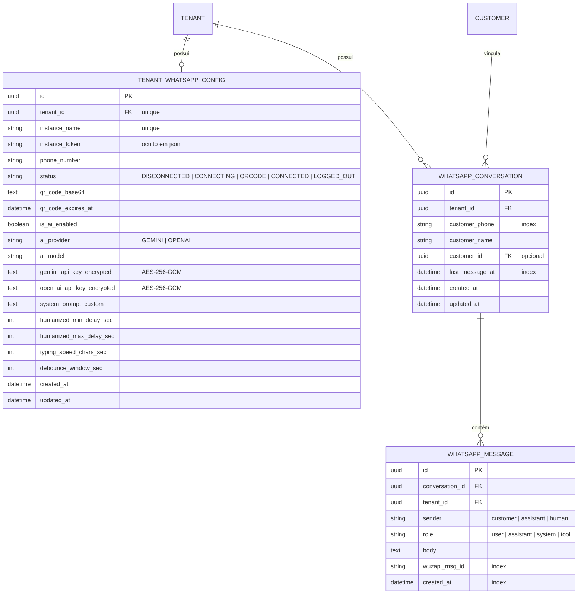
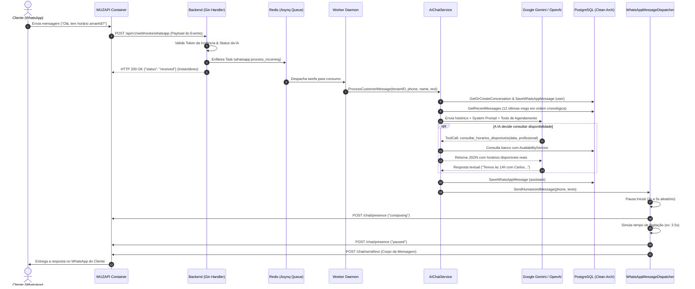

# 🤖 Módulo de Integração WUZAPI, WhatsApp Multi-Tenant & Atendimento com IA

Este documento descreve a arquitetura, modelos de dados, fluxo de eventos, camada de segurança criptográfica, tarefas em segundo plano e endpoints REST do módulo de **WhatsApp e Atendimento Automatizado com Inteligência Artificial**.

---

## 1. 📌 Visão Geral do Módulo

O módulo habilita cada estabelecimento (`Tenant`) na plataforma a conectar seu próprio número comercial de WhatsApp via leitura de **QR Code** e ativar um **Agente de IA Autônomo** (Google Gemini ou OpenAI) para atendimento a clientes, consulta de serviços/profissionais e realização de agendamentos diretos via WhatsApp com **Zero Alucinação** e **ritmo humanizado**.

### Principais Pilares:
1. **WUZAPI Integrado ao Docker Compose:** Instância local e privada do WUZAPI rodando na rede interna do Docker (`http://wuzapi:8080`), sem dependência de serviços externos pagos de WhatsApp.
2. **Isolamento Multi-Tenant:** Cada estabelecimento possui sua própria sessão, token e histórico de conversas independente.
3. **Criptografia AES-256-GCM:** As chaves de API dos provedores de IA (`gemini_api_key` e `openai_api_key`) são criptografadas em repouso com chave de 32 bytes e nonce de 12 bytes gerado com alta entropia (`crypto/rand`).
4. **Zero Alucinação com Function Calling:** O agente inteligente utiliza *Tool Calling* nativo da LLM para consultar horários reais no banco de dados e registrar agendamentos via `AppointmentService`, respeitando transações atômicas e travas contra concorrência (*double booking*).
5. **Camada de Despacho Humanizado (`WhatsAppMessageDispatcher`):** As respostas simulam comportamento humano através de:
   - Delay inicial aleatório parametrizável.
   - Presença de `"digitando..."` (`composing`) no WhatsApp durante a elaboração da mensagem.
   - Cálculo dinâmico do tempo de digitação proporcional à quantidade de caracteres (com teto mínimo e máximo).
   - Intervalos orgânicos entre múltiplos blocos de mensagens.
6. **Processamento Assíncrono com Asynq + Redis:** O webhook do WUZAPI é recebido de forma instantânea (retornando `200 OK`) e as mensagens são descarregadas na fila `whatsapp:process_incoming` para execução pelo Worker.

---

## 2. 🗄️ Modelo de Dados (GORM / PostgreSQL)



---

## 3. 🔄 Fluxo de Atendimento e Mensagens



---

## 4. 🛠️ Ferramentas da IA (Function Calling)

O modelo de linguagem interage com o sistema exclusivamente através de ferramentas estritas:

| Ferramenta | Parâmetros | Descrição |
| :--- | :--- | :--- |
| `listar_servicos` | *nenhum* | Retorna a lista de serviços ativos, preços e duração em minutos. |
| `listar_profissionais` | `servico_id` *(opcional)* | Retorna os profissionais do estabelecimento. |
| `consultar_horarios_disponiveis` | `data` (`YYYY-MM-DD`), `profissional_id` *(opcional)*, `servico_id` *(opcional)* | Executa a verificação real na agenda e retorna os horários livres. |
| `agendar_horario` | `servico_id`, `profissional_id`, `data_hora` (`YYYY-MM-DD HH:MM`), `nome_cliente`, `telefone_cliente`, `observacoes` | Cria o agendamento no banco via `AppointmentService` com verificação de concorrência. |
| `consultar_meus_agendamentos` | `telefone_cliente` | Lista os agendamentos confirmados do cliente. |
| `cancelar_agendamento` | `agendamento_id`, `motivo` | Cancela um agendamento futuro do cliente. |

---

## 5. 🌐 Catálogo de Endpoints REST (Gin)

Todas as rotas administrativas exigem cabeçalho `Authorization: Bearer <JWT_TOKEN>` e perfil `ADMIN_GLOBAL` ou `ADMIN_TENANT`, além de validação de assinatura ativa via `RequireActiveSubscription`.

| Método | Rota | Descrição | Permissão | Status Codes |
| :--- | :--- | :--- | :--- | :--- |
| `GET` | `/api/v1/admin/whatsapp/status` | Retorna o status de conexão da instância | `ADMIN_TENANT`, `ADMIN_GLOBAL` | `200`, `401`, `500` |
| `POST` | `/api/v1/admin/whatsapp/instance` | Provisiona ou recupera a instância no WUZAPI | `ADMIN_TENANT`, `ADMIN_GLOBAL` | `200`, `401`, `500` |
| `POST` | `/api/v1/admin/whatsapp/connect` | Solicita conexão e geração de QR Code | `ADMIN_TENANT`, `ADMIN_GLOBAL` | `200`, `401`, `500` |
| `GET` | `/api/v1/admin/whatsapp/qr` | Retorna o QR Code ativo em base64 | `ADMIN_TENANT`, `ADMIN_GLOBAL` | `200`, `404`, `500` |
| `POST` | `/api/v1/admin/whatsapp/disconnect` | Desconecta temporariamente o WhatsApp | `ADMIN_TENANT`, `ADMIN_GLOBAL` | `200`, `401`, `500` |
| `POST` | `/api/v1/admin/whatsapp/logout` | Encerra a sessão e apaga as credenciais locais | `ADMIN_TENANT`, `ADMIN_GLOBAL` | `200`, `401`, `500` |
| `GET` | `/api/v1/admin/whatsapp/ai-config` | Recupera as configurações de IA (sem expor API Keys) | `ADMIN_TENANT`, `ADMIN_GLOBAL` | `200`, `401`, `500` |
| `PUT` | `/api/v1/admin/whatsapp/ai-config` | Atualiza chaves de API, modelo e ritmo de humanização | `ADMIN_TENANT`, `ADMIN_GLOBAL` | `200`, `400`, `401`, `500` |
| `POST` | `/api/v1/webhooks/whatsapp` | Endpoint de recepção de eventos do WUZAPI | *Público / Token WUZAPI* | `200`, `400` |

### Exemplo de Requisição: Atualização da Configuração de IA
```http
PUT /api/v1/admin/whatsapp/ai-config
Content-Type: application/json
Authorization: Bearer <JWT>

{
  "is_ai_enabled": true,
  "ai_provider": "GEMINI",
  "ai_model": "gemini-2.5-flash",
  "gemini_api_key": "AIzaSyD-mock-key-123456",
  "system_prompt_custom": "Ofereça aos clientes nosso novo serviço de hidratação capilar.",
  "humanized_min_delay_sec": 2,
  "humanized_max_delay_sec": 4,
  "typing_speed_chars_sec": 40,
  "debounce_window_sec": 4
}
```

### Exemplo de Resposta de Sucesso:
```json
{
  "success": true,
  "message": "Configurações de IA salvas com sucesso",
  "data": {
    "is_ai_enabled": true,
    "ai_provider": "GEMINI",
    "ai_model": "gemini-2.5-flash",
    "has_gemini_api_key": true,
    "has_openai_api_key": false,
    "system_prompt_custom": "Ofereça aos clientes nosso novo serviço de hidratação capilar.",
    "humanized_min_delay_sec": 2,
    "humanized_max_delay_sec": 4,
    "typing_speed_chars_sec": 40,
    "debounce_window_sec": 4
  }
}
```

---

## 6. ⏱️ Tarefas Assíncronas (Asynq)

### `whatsapp:process_incoming`
- **Fila:** `default`
- **Timeout Máximo:** 120 segundos
- **Política de Retentativas:** 3 tentativas (`asynq.MaxRetry(3)`)
- **Payload:**
```json
{
  "tenant_id": "ae6e30a8-a6de-4a6f-9ea2-534deb35987f",
  "instance_token": "token-da-instancia",
  "customer_phone": "5511999998888",
  "customer_name": "Carlos Silva",
  "message_id": "3EB0ABC12345",
  "message_text": "Olá! Vocês tem horário para cortar cabelo amanhã às 15h?",
  "timestamp": "2026-09-14T00:30:00Z"
}
```

---

## 7. 🔒 Criptografia AES-256-GCM (`internal/crypto`)

Para garantir conformidade com a LGPD e proteger segredos de terceiros:
1. Uma chave mestra de 32 bytes é configurada via variável de ambiente `ENCRYPTION_KEY`.
2. A função `crypto.Encrypt(plainText, key)` gera um nonce de 12 bytes aleatório para cada cifra e codifica em base64: `[Nonce (12B)][Ciphertext + Tag GCM (16B)]`.
3. A função `crypto.Decrypt(ciphertextB64, key)` autentica a tag GCM e impede adulteração de dados em repouso.

---

## 8. 💻 Componentes Frontend (Vue 3 / Composition API)

- **View:** [`frontend/src/views/admin/WhatsAppView.vue`](file:///home/charles/projetos/sistema-agendamento/frontend/src/views/admin/WhatsAppView.vue)
- **Acesso pelo Router:** `/admin/whatsapp`
- **Recursos da Interface:**
  - **Status em Tempo Real:** Badges dinâmicos indicando *Desconectado*, *Aguardando Leitura de QR Code* e *Conectado*.
  - **Exibição do QR Code:** Renderização em alta definição da string base64 com timer regressivo e polling silencioso automático a cada 3,5 segundos.
  - **Formulário de IA com Máscaras Seguras:** Campos para seleção de provedor (Gemini/OpenAI), escolha de modelo de linguagem e inserção de API Keys que nunca são reenviadas para o browser após salvas.
  - **Sliders de Humanização:** Controles intuitivos para tempo de espera inicial (segundos) e velocidade de digitação simulada (caracteres por segundo).
  - **Prevenção de Vazamento de Memória:** Cancelamento explícito do polling de verificação através do hook `onUnmounted`.
